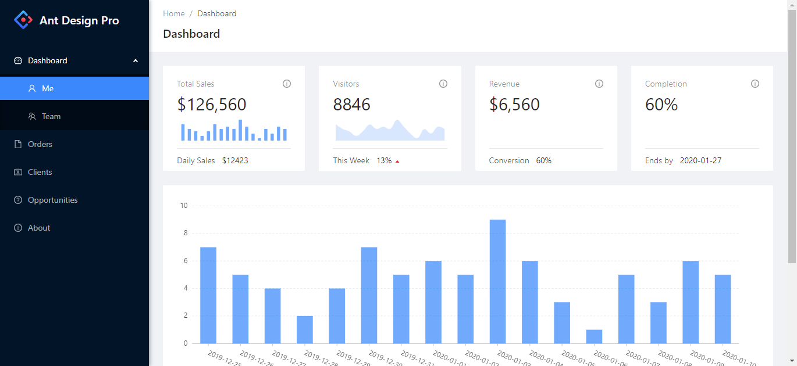

# Python AdminUI

[Documentation](https://python-adminui.readthedocs.io/en/latest/index.html)
[中文文档](https://python-adminui.readthedocs.io/zh_CN/latest/index.html)

**If you need to add component to this library, or have other suggestions, please raise an issue**

Write professional web interface with Python.

If you need a simple web interface and you don't want to mess around with
HTML, CSS, React, Angular, Webpack or other fancy Javascript frontend stuff, 
this project is for you. Now you can write web pages, forms, charts and dashboards with only Python.

This library is good for: data projects, tools and scripts, small IT systems and management systems,
Hacker or Hackathon projects. Basically if you need an interface for your system and you don't 
care much about customizing the style or performance for large traffic, consider this package.

This project is based on Flask/FastApi and Ant Design Pro.



## Features
- No HTML, CSS, JS needed
- Database agnostic: feed content at your own, no matter it's MySql, Sqlite, Excel tables, Firebase or some IoT hardware
- JWT based authentication/login system with a neat login page
- Forms and detail pages 
- Line and Bar Chart
- Create decent looking menus
- Data tables with pagination
- Adaptive to small screens and mobile devices
- Support both Flask and FastApi

# Installation and quick start

install the package with pip: 

```
pip install adminui
```

The basic "form page" example:

```
# example_form.py
from adminui import *

app = AdminApp()

def on_submit(form_data):
    print(form_data)

@app.page('/', 'form')
def form_page():
    return [
        Form(on_submit = on_submit, content = [
            TextField('Title', required_message="The title is required!"),
            TextArea('Description'),
            FormActions(content = [
                SubmitButton('Submit')
            ])
        ])
    ]

if __name__ == '__main__':
    app.run()
```

Run the Python file:

```
python example_form.py
```

Then visit http://127.0.0.1:5000/ to see the result.

## Use FastApi instead of Flask

Set `use_fastapi=True` when creating the `app`; and `prepare()` instead of `run()` to expose the app to uvicorn. See python/example_fastapi.py for details

```
# instead of app = AdminApp(), use
app = AdminApp(use_fastapi=True)

# ... other stuff you do with adminui app

# in the end of the main file, use
fastapi_app = app.prepare()

# in command line, run:
# uvicorn example_fastapi:fastapi_app
```

# Documentation

Hosted on [Read the Docs](https://python-adminui.readthedocs.io/en/latest/index.html)


# Contributing and Development

This is a personal project. So please create issues to tell me what you need from this project.

You may also give stars to let me know if this project is worthy to invest more time on.

To work with the source code:

This project has a Typescript front-end and a Python backend.  
The front-end is in the `/src` folder.  
The back-end is in the `/python` folder.  
To start developing:

- cd into `/python` folder and run `pip install -r requirements.txt` to install requirements
- run one of the example_xxx.py file in the `/python` folder
- Open another terminal, run `npm install` & `npm start` at the root folder to start the frontend; 

Under this development mode, requests from front-end will forward to the backend.

When you are done with developing: 
- run `npm run build` will build the project. 

The front-end is based on the amazing [Ant Design Pro](https://pro.ant.design/docs/getting-started) library, you may consult their documentation during the development.

The Python backend is located in `/python/adminui`. It is Flask based. There are some examples in the `/python` folder.

# Release log for early preview

- 1.5.0: Tooltip and pie chart title (pr #57 by harry3689)
- 1.4.9: [shared app](https://python-adminui.readthedocs.io/en/latest/organize_app.html) for project structuring; adding Popconfirm
- 1.4.8: customer colors in charts (thanks harry3689's pr #56), fixes #52 and #51
- 1.4.7: fixes placeholder text on login, labels in ModelForms; added badge for tables
- 1.4.6: render links in table columns
- 1.4.5: icon, Notification types, custom favicon
- 1.4.4: Added Empty and Result status, buttons are not linkable
- 1.4.3: New ScatterPlot, added password field
- 1.4.2: Image tag, timer, tabs, and Spin(loading) element
- 1.4.1: allow changing Signup link / forget password link. Add `size` attribute to DataTable
- 1.4.0: new chart api(old ones still work), supports pie chart and progress bar/circle
- 1.3.0: allow serving additional static folders and multiple parameters
- 1.2.3: allow changing footer text, footer links and logo
- 1.2.2: fix #36 #37 #38
- 1.2.1: fix a bug with page actions in DataTable (#33) and corrected header 1 font size issue (#29)
- 1.2.0: add filter form to tables; add model dialog (see python/example_form.py for a full example)
- 1.1.0: add Radio buttons and filter/sortable feature of DataTables
- 1.0.0: add FastApi support
- 0.3.9: fix color issue in charts