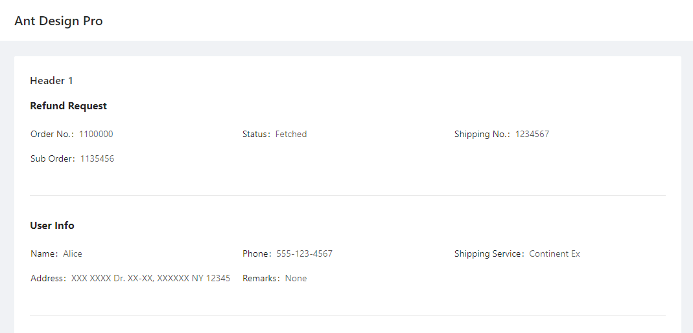
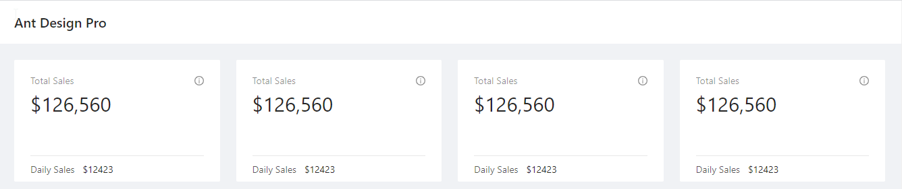

Layout and Creating a Detail Page
==================================

When you want to show complex information on the page, you may use ``Card``, ``Header``, 
``DetailGroup``, ``DetailItem`` and ``Divider`` to help you format the page::

    @app.page('/detail', 'Detail Page')
    def detail_page():
        return [
            Card(content=[
                Header('Header of the record', 1),
                DetailGroup('Refund Request', content=[
                    DetailItem('Order No.', 1100000),
                    DetailItem('Status', "Fetched"),
                    DetailItem('Shipping No.', 1234567),
                    DetailItem('Sub Order', 1135456)
                ]),
                Divider(),
                DetailGroup('User Info', content=[
                    DetailItem('Name', "Alice"),
                    DetailItem('Phone', "555-123-4567"),
                    DetailItem('Shipping Service', 'Continent Ex'),
                    DetailItem('Address', 'XXX XXXX Dr. XX-XX, XXXXXX NY 12345'),
                    DetailItem('Remarks', "None")
                ]),
            ])
        ]

It looks like this:

If you are working with a dashboard, ``Row``, ``Column``, ``Statistic`` may come in handy.
``ChartCard`` can make a neat little block to hold your numbers and charts. See example::

    @app.page('/dashboard', 'Dashboard')
    def dashboard_page():
    return [
        Row([
            Column([
                ChartCard('Total Sales', '$126,560', 'The total sales number of xxx', height=50,
                    footer=[Statistic('Daily Sales', '$12423', inline=True)])
            ]),
            Column([
                ChartCard('Total Sales', '$126,560', 'The total sales number of xxx', height=50,
                    footer=[Statistic('Daily Sales', '$12423', inline=True)])
            ]),
            Column([
                ChartCard('Total Sales', '$126,560', 'The total sales number of xxx', height=50,
                    footer=[Statistic('Daily Sales', '$12423', inline=True)])
            ]),
            Column([
                ChartCard('Total Sales', '$126,560', 'The total sales number of xxx', height=50,
                    footer=[Statistic('Daily Sales', '$12423', inline=True)])
            ]),
        ])
    ]

It creates a page like this:

If you just want to display some text, use ``Paragraph``. You may set the color of the Paragraph::

    Paragraph("The text of Paragraph", color="red")

If you wish to format rich text or other complex content, you may use RawHTML Element.
Beware this is dangerous because if you pass unfiltered user text (e.g. from a piece of user 
inputted text stored in the database), this user text may contain dangerous code that may run 
on the client's computer::

    RawHTML('a raw HTML')

Here's the list of layout-related classes:

.. autoclass:: adminui.Card
   :members:

.. autoclass:: adminui.Header
   :members:

.. autoclass:: adminui.Paragraph
   :members:

.. autoclass:: adminui.DetailGroup
   :members:

.. autoclass:: adminui.DetailItem
   :members:

.. autoclass:: adminui.Row
   :members:

.. autoclass:: adminui.Column
   :members:

.. autoclass:: adminui.ChartCard
   :members:

.. autoclass:: adminui.Statistic
   :members:

