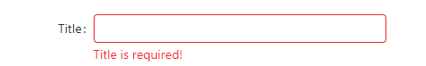
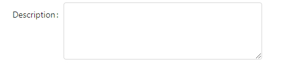
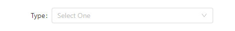
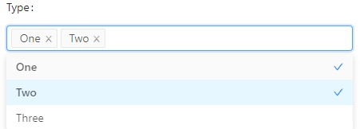
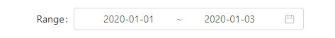
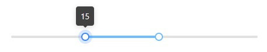

Creating a Form
===============

To create a form, insert a ``Form`` object inside the list describing the page::

    @app.page('/', 'Form')
    def form_page():
        return [
            Form(on_submit = my_function, 
                   content = [ ... content of the form ... ])
        ]

Here, you may want to provide a function that will be called when the user submits 
the form, so you can process the data. The function may have any name, here ``my_function``
is used as an example. This function needs to be defined with an argument, which will be
the form values as a dictionary::

    def my_function(values):
        ... do things with values ...

In the content section of the form, you may add ``TextField`` and other form controls. See 
the next section for details

Finally, don't forget to add a submit button. Insert a ``FormActions`` object with ``Submit``
at the end of the form::

    FormActions(content = [
        SubmitButton('Submit')
    ])

Now your form is created.

List of Form Controls
**************************************

Here are a list of controls you may use in your form:

TextField
---------

.. code-block:: python

    TextField('Title', required_message='Title is required!')

.. autoclass:: adminui.TextField
   :members:

TextArea
---------

.. code-block:: python

    TextArea('Description')

.. autoclass:: adminui.TextArea
   :members:

Select
---------

.. code-block:: python

    SelectBox('Type', data=['One', 'Two', 'Three'], placeholder="Select One")
    # use multiple=True to allow multiple selecting:
    SelectBox('Type', data=['One', 'Two', 'Three'], placeholder="Select Many", multiple=True)
    # use tags=True to input tags - users can input arbitrary text as a tag:
    SelectBox('Type', data=['One', 'Two', 'Three'], placeholder="Select Many", tags=True)

.. autoclass:: adminui.SelectBox
   :members:

Checkboxes
----------

.. code-block:: python

    CheckboxGroup('Checks', data=['One', 'Two'])

.. autoclass:: adminui.CheckboxGroup
   :members:

DatePicker
----------

.. code-block:: python

    DatePicker('Date')

.. code-block:: python

    DatePicker('Range', pick='range')

.. autoclass:: adminui.DatePicker
   :members:

Callback when form item changes
**************************************

If you want to do something, say update a part of the page when user select an item in the SelectBox
or input text on the TextFields, you may add on_change handlers in your Python code::

    TextField('Title', required_message='Title is required!', on_change=on_change),

    # for the handler:
    def on_change(value, values):
        print(value)
        print(values)

See chapter :ref:`Page Actions`. for details on what can handlers do.

The handler could be a function taking one or two parameters: the first will be the new value of the form item;
the second one will be a dictionary of all the values in the form where the form item lives. This will be useful
for example when your data shown in the page is filtered by a list of criterions.

Slider, Switch and other controls
**************************************

These are not form controls. But they respond to on_change handlers.

Slider
---------

.. code-block:: python

    Slider(on_change=on_change)
    # this will render a slider, with 0~50 range
    # and user can pick up a range, with an initial value 20~30
    Slider(0, 50, range=True, value=[20,30])

Switch
---------

.. code-block:: python

    Switch(on_change=on_change)

Checkbox
---------

.. code-block:: python

    Checkbox(on_change=on_change)