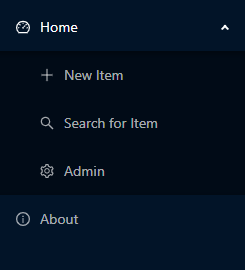

Creating a Menu
================

To create a menu for your project, use the ``set_menu`` function 
of the ``AdminApp`` object::

    app.set_menu([ ... a list of menu items ...])

the ``set_menu`` method takes an array of ``MenuItem`` objects:

.. autoclass:: adminui.MenuItem
   :members:

You may nest ``MenuItem`` to create sub-menus. Here's a complete example::

    app.set_menu(
        [
            MenuItem('Home', '/', icon="dashboard", children=[
                MenuItem('New Item', '/new', icon="plus"),
                MenuItem('Search for Item', '/search', icon="search"),
                MenuItem('Admin', '/admin', icon="setting")
            ]),
            MenuItem('About', '/about', icon="info-circle")
        ]
    )

It looks like this:

