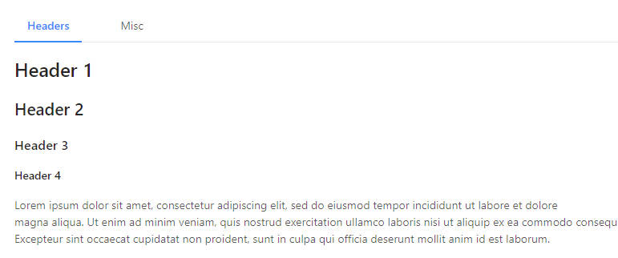
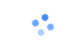
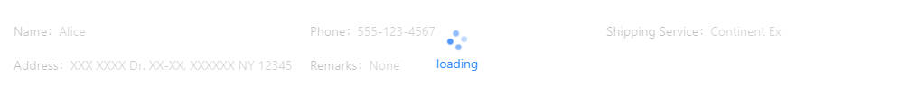
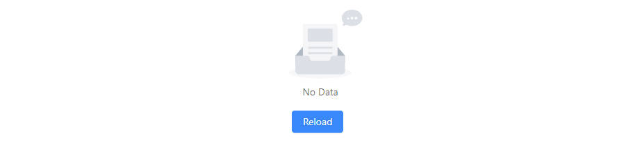
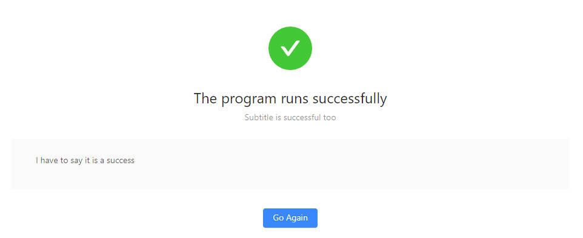
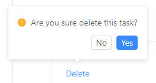
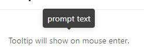

Other Components
============================

Icons
********

You can add one of the Ant Design icons using ``Icon``::

    Icon('sync')

A full list can be seen at:
https://3x.ant.design/components/icon-cn/

only outline style icons are supported.

You may set the color and size of the icon.

.. autoclass:: adminui.Icon
   :members:

Progress
********

You can draw a progress bar with::

    Progress(30)
    Progress(30, format='circle')

.. image:: images/other/circle_progress.jpg

Image
********

To add an image::

    Image('https://url-of-the-image', 'alt-text', width=300)

Group (HTML Div)
********

Use Group to group content together, so you may change them with 
``UpdateElement`` page action

(in fact, it just creates a 
 element in html)::

    Group(id='id of the content', content=[...content in the group])

Tabs
********

Use tabs to group content together::

    Tabs([
        Group(name='title of tab 1', content=[
            ... content of tab 1
        ]),
        Group(name='title of tab 2', content=[
            ... content of tab 2
        ]),
    ]),

You may set the tab appearance with ``position``, ``format``, and ``size``, see

.. autoclass:: adminui.Tabs
   :members:

Spin
********

Creates a spinning wheel::

    Spin()

You can also setup a region masked under a spinning wheel.
When the loading is done, remove it with Page Actions::

    Spin('loading', content=[
        ... content under the mask...
    ]),

.. autoclass:: adminui.Spin
   :members:

Empty Status
************

Display the empty status::

    Empty()

.. autoclass:: adminui.Empty
   :members:

Result
************

Display the result of an operation::

    Result('The program runs successfully')

.. autoclass:: adminui.Result
   :members:

Popconfirm
************

    
Let the user confirm before performing an action::

    Popconfirm('Are you sure to do something?', on_submit=on_submit, content=[
        ... put adminui elements here, which will trigger the confirm box when clicked ...
    ], data=CUSTOM_DATA)

note that ``CUSTOM_DATA`` may be passed to the ``on_submit`` callback, when the user choose YES
in the confirm box.

You may customize the OK and Cancel button of the pop confirm box by setting ``ok_text`` and 
``cancel_text`` of the element

.. autoclass:: adminui.Popconfirm
   :members:

Tooltip
************

Display a tooltip when the mouse is hovering some elements::

    Tooltip('Text on the tooltip', [
        ... content which will trigger the tooltip when hovered ...
    ])

.. autoclass:: adminui.Tooltip
   :members: