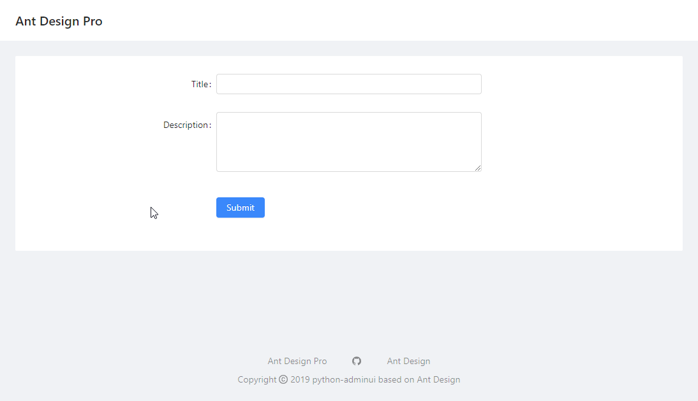

Installation and Quick Start
============================

Install the package with pip::

    pip install adminui

Now create a python file for your project, say example.py:

.. code-block:: python

    from adminui import *

    app = AdminApp()

    def on_submit(form_data):
        print(form_data)

    @app.page('/', 'Form')
    def form_page():
        return [
            Form(on_submit = on_submit, content = [
                TextField('Title', required_message="The title is required!"),
                TextArea('Description'),
                FormActions(content = [
                    SubmitButton('Submit')
                ])
            ])
        ]

    if __name__ == '__main__':
        app.run()

Run the python file from terminal::

    python example_form.py

Now visit http://127.0.0.1:5000/ to see the index page. 
It should look like this:

Basic Concepts and Example Breakdown
**************************************

First of all, you need to create a AdminApp object::

    app = AdminApp()

Then you add pages to your app. Use the ``@app.page`` decorator, 
followed by a custom function (its name doesn't matter) that returns 
an array of the page elements shown when the user visit a certain url::

    @app.page('/', 'Form')
    def form_page():
        return [ ...put page contents here... ]

The ``@app.page`` decorator receives two argument. One for the url ('/' in this case), 
and the other for the title of the page("Form"). 

By decorating a function, you'll be able to return different page elements or data
each time the user visit the page.

All page elements are Python objects. You may refer to other chapters
of this documentation to know how to use them. We can see that the 
example above created a form, a text field, a text area and a submit button.

Finally, run the app using::

    app.run()

Use FastAPI instead of Flask
**************************************

Set ``use_fastapi=True`` when creating the ``app``; and ``prepare()`` instead of ``run`` to expose the app to uvicorn.  

The basic example will be:

.. code-block:: python

    from adminui import *

    app = AdminApp(use_fastapi=True)

    def on_submit(form_data):
        print(form_data)

    @app.page('/', 'Form')
    def form_page():
        return [
            Form(on_submit = on_submit, content = [
                TextField('Title', required_message="The title is required!"),
                TextArea('Description'),
                FormActions(content = [
                    SubmitButton('Submit')
                ])
            ])
        ]

    fastapi_app = app.prepare()

Then run from command line::

    uvicorn example_fastapi:fastapi_app
