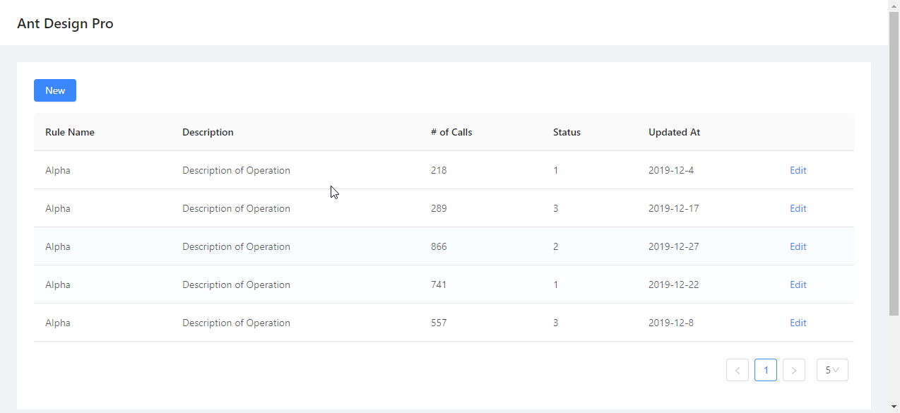

Use Data Tables
============================

A table page looks like this::

    @app.page('/', 'Table')
    def table_page():
        return [
            Card(content = [
                DataTable("Example Table", columns=table_columns, 
                    data=TableResult(table_data))])
        ]

We use DataTable class to construct a table with data:

.. autoclass:: adminui.DataTable
   :members:

Prepare data for a Table
**************************************

DataTable needs a column definition and a data parameter.
the data required in the columns field looks like this::

    table_columns = [
        {'title': 'Rule Name', 'dataIndex': 'name'},
        {'title': 'Description', 'dataIndex': 'desc'},
        {'title': '# of Calls', 'dataIndex': 'callNo'},
        {'title': 'Status', 'dataIndex': 'status'},
        {'title': 'Updated At', 'dataIndex': 'updatedAt'}
    ]

each column is a dictionary, with ``title`` and ``dataIndex``.
``dataIndex`` will be used as the key of the provided table rows data::

    table_data = [
                    "callNo": 76,
                    "desc": "Description of Operation",
                    "id": 0,
                    "name": "Alpha",
                    "status": 3,
                    "updatedAt": "2019-12-13"
                },
                ... other rows
    ]

``table_data`` need to be passed with a ``TableResult`` object::

    DataTable("Example Table", columns=table_columns, 
                    data=TableResult(table_data))

``TableResult`` will also be used in case of pagination.

Pagination
**************************************

In case you have multiple pages of data for the table and you can only
display some in a page (for example, records read from a database), 
you'll need pagination.

You need to do two things: 

First, fill ``TableResult`` with information such as total number of records, 
current page and page size. So the table knows how many page buttons it should
display to the user::

    DataTable("Example Table", columns=table_columns, 
                data=TableResult(table_data, 1000))

.. autoclass:: adminui.TableResult
   :members:

Second, provide a ``on_data`` callback function to ``DataTable``, so AdminUI
knows what data to load when the user turns a page::

    def on_page(args):
        records = (... load records somewhere from the database, 
            with args['current_page'] and args['page_size'])
        return TableResult(mock_table_data(5), 1000, args['current_page'])
    DataTable("Example Table", columns=table_columns, 
                data=TableResult(table_data, 1000), on_data=on_page)

Now you have a table serving multi-paged data.

Action Links for each Row
**************************************

You may also add an action link to each row. This is useful when the user can do
something to the records. For example, for a table of articles, the user may wish
to edit a single one.

In this case, fill the ``row_actions`` argument with a list of ``TableRowAction``::

    DataTable("Example Table", columns=table_columns, 
                    data=TableResult(table_data)
                    row_actions=[
                        TableRowAction('edit', 'Edit', on_click=on_edit),
                    ])

.. autoclass:: adminui.TableRowAction
   :members:

In this case, an "Edit" link will be shown on the right side of each row of the table.
If the user clicks one of them, the passed function ``on_edit`` will be called::

    def on_edit(record):
        ...do something with the table record

A complete example of table is listed here
https://github.com/bigeyex/python-adminui/blob/master/python/example_table.py