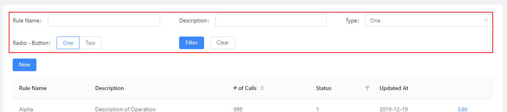
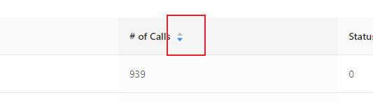
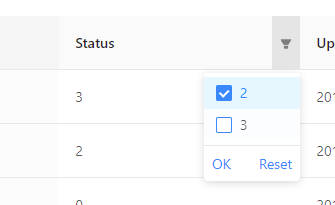

Use Data Tables
============================

A table page looks like this::

    @app.page('/', 'Table')
    def table_page():
        return [
            Card(content = [
                DataTable("Example Table", columns=table_columns, 
                    data=TableResult(table_data))])
        ]

.. image:: images/simple_table_screenshot.png

We use DataTable class to construct a table with data:

.. autoclass:: adminui.DataTable
   :members:

Prepare data for a Table
**************************************

DataTable needs a column definition and a data parameter.
the data required in the columns field looks like this::

    table_columns = [
        {'title': 'Rule Name', 'dataIndex': 'name'},
        {'title': 'Description', 'dataIndex': 'desc'},
        {'title': '# of Calls', 'dataIndex': 'callNo'},
        {'title': 'Status', 'dataIndex': 'status'},
        {'title': 'Updated At', 'dataIndex': 'updatedAt'}
    ]

each column is a dictionary, with ``title`` and ``dataIndex``.
``dataIndex`` will be used as the key of the provided table rows data::

    table_data = [
                    "callNo": 76,
                    "desc": "Description of Operation",
                    "id": 0,
                    "name": "Alpha",
                    "status": 3,
                    "updatedAt": "2019-12-13"
                },
                ... other rows
    ]

``table_data`` need to be passed with a ``TableResult`` object::

    DataTable("Example Table", columns=table_columns, 
                    data=TableResult(table_data))

``TableResult`` will also be used in case of pagination.

Render a column as a link
**************************************

If you want a column in the table shown as a link,
set the column definition as::
    
    {'title': 'Rule Name', 'dataIndex': 'name', 'linkTo': 'link'},

Then the column's ``title`` will be shown as a link, linking to data field
with key ``link``

Pagination
**************************************

In case you have multiple pages of data for the table and you can only
display some in a page (for example, records read from a database), 
you'll need pagination.

You need to do two things: 

First, fill ``TableResult`` with information such as total number of records, 
current page and page size. So the table knows how many page buttons it should
display to the user::

    DataTable("Example Table", columns=table_columns, 
                data=TableResult(table_data, 1000), on_data=on_page)

.. autoclass:: adminui.TableResult
   :members:

Second, provide a ``on_data`` callback function to ``DataTable``, so AdminUI
knows what data to load when the user turns a page::

    def on_page(args):
        records = (... load records somewhere from the database, 
            with args['current_page'] and args['page_size'])
        return TableResult(mock_table_data(5), 1000, args['current_page'])

Now you have a table serving multi-paged data.

Action Links for each Row
**************************************

You may also add an action link to each row. This is useful when the user can do
something to the records. For example, for a table of articles, the user may wish
to edit a single one.

In this case, fill the ``row_actions`` argument with a list of ``TableRowAction``::

    DataTable("Example Table", columns=table_columns, 
                    data=TableResult(table_data)
                    row_actions=[
                        TableRowAction('edit', 'Edit', on_click=on_edit),
                        TableRowAction('edit', icon='edit', on_click=on_edit), # use icons
                    ])

.. autoclass:: adminui.TableRowAction
   :members:

In this case, an "Edit" link will be shown on the right side of each row of the table.
If the user clicks one of them, the passed function ``on_edit`` will be called::

    def on_edit(record):
        ...do something with the table record

Use Filter Forms
**************************************

You may add a filter form, to let users search in your table.  
Each time the user submits the form or switch pages, values in the form will be passed
along to the ``on_data`` callback.  

To add filter form, set ``filter_form`` field in DataTable element::

    DataTable("Example Table", columns=...,  data=..., on_data=on_page,
                filter_form=FilterForm([
                    TextField('Rule Name'),
                    TextField('Description'),
                    SelectBox('Type', data=['One', 'Two', 'Three'], placeholder="Select One"),
                    RadioGroup('Radio - Button', data=[['One', 1], ['Two', 2]], format='button'),
                ], submit_text='Filter', reset_text='Clear'),
                row_actions=[...],
                table_actions=[...])

Note that you can change the text on submit button and reset button, using
``submit_text`` and ``reset_text`` field.

Sortable and Filterable Columns
**************************************

To make table column sortable, set ``sorter=True`` to the column definition::

    table_columns = [
        {'title': '# of Calls', 'dataIndex': 'callNo', 'sorter': True},
        ...
    ]

Then, when the user click on the header of the column, ``on_data`` callback will 
receive an additional ``sorter`` argument like::

    sorter: "callNo_descend"

Separated by underscore, the first part is the ``dataIndex`` field, 
the second part is descend or ascend according the current sorting status.

To make a table column filterable, set filters on the column definition like::

    {'title': 'Status', 'dataIndex': 'status', 'filters': [{'text': 2, 'value': 2}, {'text': 3, 'value': 3}]},

Then the column will be filterable. When the user filters some columns, ``on_data``
will receive arguments like::

    filters: {status: "3,2"}

where the key will be the filtered column's data index, and the value will be the filtered values, 
separated by commas.

Change the height of rows
**************************************
pass ``size`` to DataTable will allow you to change the row height. 
You may choose from ``'default' | 'middle' | 'small'``::

    DataTable(..., size='small')

A complete example of table is listed here
https://github.com/bigeyex/python-adminui/blob/master/python/example_table.py